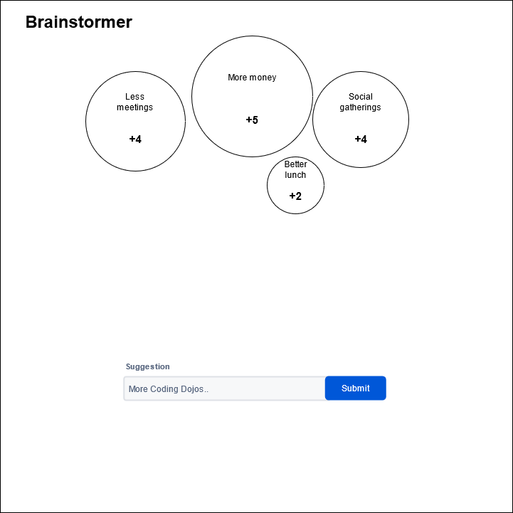

# Bouvet Fagdag Code Dojo

## Alle løser samme oppgave

I dagens Dojo skal vi alle løse samme oppgave, men med forskjellige verktøy.

Gruppene kan velge om de vil bruke enten Svelte eller ELM.

På slutten av sesjonen møtes vi igjen for å vise frem resultatet og diskutere erfaringer.

## Gjennomføringsplan

1. Etter introkduksjon på Teams, deler vi oss inn i grupper på 2-3 personer
2. Vi prøver å benytte Breakout Rooms på Teams når vi jobber i mindre grupper
3. Installere det som trengs, og bare gønne på med oppgaven
4. Kl 14.00 møtes vi igjen i hovedrommet på Teams for å diskutere og vise resultatet. 

## Oppgaven

### Brainstormer

Vi skal lage en webapplikasjon som kan hjelpe å fasilitere brainstorming, eller idemyldring.

1. Bruker skal kunne skrive inn en ide
2. Når en ide er sendt inn, så skal den vises på siden
3. En skal kunne klikke på en ide for å gi den en stemme/poeng

Skisse:

Det er ikke viktig at resultatet ser ut som skissen. Den er bare laget for å gi inspirasjon.
Dersom en får tid til overs er det bare å finne på nye kule funksjoner.

Her er noe inspirasjon til videre funksjonalitet:

- Lage relasjoner mellom ideer
- Oprette prosjekter for å organisere ting
- Slette en ide
- Størrelsen på hvert inspill kan gjenspeile antall stemmer
- Animasjoner når en ide blir opprettet og når det gis poeng

Om en har mye tid til overs vil jeg anbefale å deploye applikasjonen til nettet.
Da blir det lettere å vise den frem til andre.
Anbefaler [Netlify](https://www.netlify.com/) til å hoste. Dette er gratis og har en veldig enkel "drag-drop" deploy.

## Svelte

Svelte vil nok føles ganske kjent for folk som tidligere har brukt rammeverk som React, Vue og Angular.
Det er et komponent-basert rammeverk, men som skiller seg fra React og Vue ved å utføre mye av den tunge prosesseringen
under kompilering, og ikke i nettleseren.

Les mer om Svelte [her](https://svelte.dev/blog/svelte-3-rethinking-reactivity)

### Kom i gang

Du må ha Node installert.

Node kan lastes ned [HER](https://nodejs.org/en/)

Jeg fikk problemer med en eldre versjon av Node.
Dersom du får problemer med installeringen anbefaler jeg å bruke [NVM](https://github.com/nvm-sh/nvm)
til å installere og ta i bruk siste versjon av Node.

Klon ned start-templaten her

`git clone https://github.com/MikkelBirkeland/Svelte-Start-Template.git`

Dette er samme Template du finner på Svelte sine [sider](https://svelte.dev/)

Gå inn i mappen

`cd Svelte-Start-Template`

Installer stuff

`npm install`

Start dev serveren

`npm run dev`

Om alt gikk etter planen, så er du klar til å begynne.

Sjekk ut [tutorial](https://svelte.dev/tutorial/basics) for en introduksjon til Svelte.

Jeg anbefaler [VSCode](https://code.visualstudio.com/) som editor.
Det er også lurt å installere en Extension som heter Svelte for VSCode.

Dersom en ikke får ting til å virke, sjekk ut denne online [sandboxen](https://codesandbox.io/s/svelte) for å teste ut
Svelte uten å måtte installere noe.

## ELM

ELM er et funksjonelt språk laget for å lage webapplikasjoner.
Det kompileres til JavaScript, som vil si at du i praksis kan ta i bruke ELM alle steder
en bruker JavaScript.

Dersom en ikke har brukt rent funksjonelle språk tidligere, vil det nok være ganske uvandt i starten.

Den flotte [guiden](https://guide.elm-lang.org/) inneholder alt dere trenger for å løse oppgaven.

### Kom i gang

Sjekk ut [Guiden](https://guide.elm-lang.org/install/elm.html) for å installere og komme i gang med ELM.

Jeg anbefaler [VSCode](https://code.visualstudio.com/) som editor.

Installer ELM extension for å få litt ekstra hjelp av editoren.

Dersom installering ikke går bra, sjekk ut [online editor](https://elm-lang.org/try)
Det skal være mulig å gjennomføre oppgaven her.
